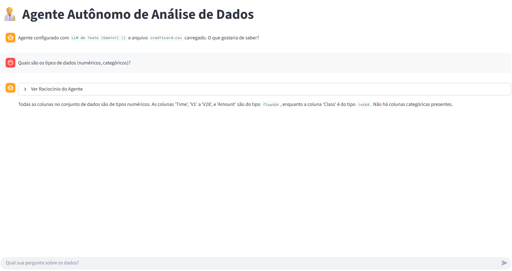
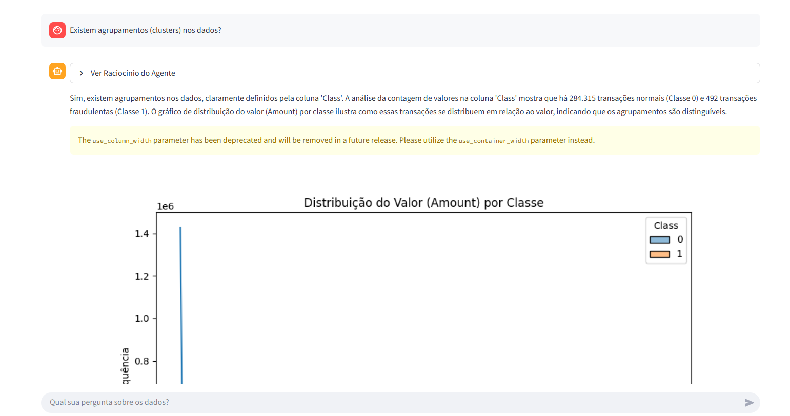

# 👨‍🔬 Agente Autônomo de Análise de Dados

Este projeto é um agente autônomo construído com Python, Streamlit e LangChain, projetado para realizar Análise Exploratória de Dados (EDA) em arquivos CSV e Excel. O usuário pode interagir com seus dados através de uma interface de chat, fazendo perguntas em linguagem natural para obter insights, gerar visualizações

[](https://eliezer-eda-i2a2.streamlit.app/)

**Acesse a demonstração ao vivo:** [https://eliezer-eda-i2a2.streamlit.app/](https://eliezer-eda-i2a2.streamlit.app/)

## 🎯 Funcionalidades Principais

- **Análise via Chat**: Faça perguntas em linguagem natural sobre seu conjunto de dados.
- **Visualizações Inteligentes**: Gere gráficos (barras, dispersão, histogramas, etc.) automaticamente.
- **Análise Exploratória de Dados (EDA)**: Obtenha estatísticas descritivas, informações sobre colunas e tipos de dados.
- **Portabilidade de LLMs**: Suporte para múltiplos provedores de LLM, incluindo:
  - Google Gemini
  - OpenAI
  - Groq
  - Anthropic
- **Modo de Teste**: Inclui uma opção "LLM de Teste" pré-configurada com o Gemini, permitindo o uso imediato sem a necessidade de uma chave de API.
- **Transparência do Agente**: Visualize o "raciocínio" do agente, incluindo o código Python executado e os resultados obtidos em cada passo.

---

## 🚀 Exemplos de Uso

#### Exemplo 1: Análise Exploratória Inicial

**Pergunta do Usuário:**
```
Quais são os tipos de dados (numéricos, categóricos)?
```

**Raciocínio do Agente:**
```
🔄 Ciclo 1
1. Pensamento
A pergunta é sobre os tipos de dados presentes no DataFrame. Para responder a isso, preciso inspecionar os tipos de dados de cada coluna no DataFrame `df`. A função `df.info()` é ideal para isso, pois ela lista todas as colunas, o número de entradas não nulas e o tipo de dado de cada coluna.
Action: python_code_executor
Action Input: print(df.info())
2. Ação
Ferramenta: python_code_executor

Entrada da Ação (código executado):

print(df.info())

3. Observação
Execução bem-sucedida. Saída:

<class 'pandas.core.frame.DataFrame'>
RangeIndex: 284807 entries, 0 to 284806
Data columns (total 31 columns):
 #   Column  Non-Null Count   Dtype  
---  ------  --------------   -----  
 0   Time    284807 non-null  float64
 1   V1      284807 non-null  float64
 2   V2      284807 non-null  float64
 3   V3      284807 non-null  float64
 4   V4      284807 non-null  float64
 5   V5      284807 non-null  float64
 6   V6      284807 non-null  float64
 7   V7      284807 non-null  float64
 8   V8      284807 non-null  float64
 9   V9      284807 non-null  float64
 10  V10     284807 non-null  float64
 11  V11     284807 non-null  float64
 12  V12     284807 non-null  float64
 13  V13     284807 non-null  float64
 14  V14     284807 non-null  float64
 15  V15     284807 non-null  float64
 16  V16     284807 non-null  float64
 17  V17     284807 non-null  float64
 18  V18     284807 non-null  float64
 19  V19     284807 non-null  float64
 20  V20     284807 non-null  float64
 21  V21     284807 non-null  float64
 22  V22     284807 non-null  float64
 23  V23     284807 non-null  float64
 24  V24     284807 non-null  float64
 25  V25     284807 non-null  float64
 26  V26     284807 non-null  float64
 27  V27     284807 non-null  float64
 28  V28     284807 non-null  float64
 29  Amount  284807 non-null  float64
 30  Class   284807 non-null  int64  
dtypes: float64(30), int64(1)
memory usage: 67.4 MB
None
```
**Resposta do Agente:**
```
Todas as colunas no conjunto de dados são de tipos numéricos. As colunas 'Time', 'V1' a 'V28', e 'Amount' são do tipo float64, enquanto a coluna 'Class' é do tipo int64. Não há colunas categóricas presentes.
```


#### Exemplo 2:

**Pergunta do Usuário:**
```
Existem agrupamentos (clusters) nos dados? .
```

**Resposta do Agente:**

Sim, existem agrupamentos nos dados, claramente definidos pela coluna 'Class'. A análise da contagem de valores na coluna 'Class' mostra que há 284.315 transações normais (Classe 0) e 492 transações fraudulentas (Classe 1). O gráfico de distribuição do valor (Amount) por classe ilustra como essas transações se distribuem em relação ao valor, indicando que os agrupamentos são distinguíveis.




#### Exemplo 3:

**Pergunta do Usuário:**
```
Existem valores atípicos nos dados?
```

**Resposta do Agente:**

Sim, existem valores atípicos nos dados, especialmente na coluna 'Amount'. O boxplot da distribuição do valor (Amount) por classe mostra claramente a presença de muitos valores extremos, tanto para transações normais quanto para as fraudulentas. Esses valores atípicos são pontos de dados que se desviam significativamente da maioria dos dados.

---

---

#### Exemplo 4:

**Pergunta do Usuário:**
```
Existe correlação entre as variáveis?
```

**Resposta do Agente:**

Sim, existe correlação entre as variáveis, mas a maioria das variáveis 'V' (V1 a V28) apresenta correlações muito baixas entre si, indicando independência. A variável 'Amount' tem correlações negativas moderadas com algumas variáveis 'V' (como V2, V5, V7, V10, V17, V20). A variável 'Class' (indicando transações normais ou fraudulentas) tem correlações muito fracas com a maioria das outras variáveis, com algumas correlações negativas fracas com V1, V3, V7, V14, V17 e positivas fracas com V4, V11, V12, V13, V26. O gráfico da matriz de correlação está disponível em temp_charts/correlation_heatmap.png.


---
#### Exemplo 5:

**Pergunta do Usuário:**
```
Quais suas conclusões sobre as perguntas?
```

**Resposta do Agente:**

Com base nas análises anteriores, podemos concluir o seguinte:

* Tipos de Dados: O conjunto de dados é composto inteiramente por variáveis numéricas, sem a presença de dados categóricos.
* Agrupamentos: Os dados apresentam agrupamentos claros definidos pela coluna 'Class', que distingue entre transações normais (Classe 0) e fraudulentas (Classe 1). Há uma desproporção significativa, com muito mais transações normais do que fraudulentas.
* Valores Atípicos: A coluna 'Amount' exibe a presença de valores atípicos, indicando transações com valores que se desviam consideravelmente da maioria.
* Correlações: A maioria das variáveis de identificação ('V1' a 'V28') possui baixa correlação entre si. A variável 'Amount' apresenta correlações negativas moderadas com algumas dessas variáveis 'V'. A variável 'Class' tem correlações fracas com a maioria das outras variáveis, sugerindo que a identificação de fraudes pode depender de combinações complexas de fatores ou de outras métricas não diretamente capturadas por correlações lineares simples. A matriz de correlação completa foi gerada e está disponível. de combinações complexas de fatores ou de outras métricas não diretamente capturadas por correlações lineares simples. A matriz de correlação completa foi gerada e está disponível.
---

## 🛠️ Tecnologias Utilizadas

- **Linguagem**: Python 3.10+
- **Interface**: Streamlit
- **Framework de Agente**: LangChain
- **Manipulação de Dados**: Pandas
- **Visualização**: Matplotlib & Seaborn
- **Variáveis de Ambiente**: python-dotenv

## 🏗️ Arquitetura do Projeto

O agente utiliza o padrão **ReAct (Reasoning and Acting)**, onde o LLM raciocina sobre qual ferramenta usar para responder a uma pergunta e então age executando essa ferramenta.

1.  **Interface do Usuário (`main.py`)**: Construída com Streamlit, a interface permite ao usuário configurar o LLM, fazer upload de um arquivo e interagir com o agente através de um chat.
2.  **Criação do Workflow (`workflow.py`)**: Este módulo é o coração do agente. Ele:
    - Instancia o LLM escolhido pelo usuário (Gemini, OpenAI, etc.).
    - Cria as ferramentas disponíveis para o agente (atualmente, uma ferramenta `python_code_executor`).
    - Carrega e personaliza um prompt ReAct, instruindo o LLM sobre como se comportar, como usar as ferramentas e o formato da resposta.
    - Monta o `AgentExecutor`, que orquestra a interação entre o LLM, as ferramentas e o prompt.
3.  **Ferramentas Customizadas (`tools/custom_tools.py`)**: Define as capacidades do agente. A principal ferramenta é o `python_code_executor`, que executa código Python em um ambiente seguro para analisar o DataFrame `df`.
4.  **Fluxo de Execução**:
    - O usuário envia uma pergunta.
    - O `AgentExecutor` passa a pergunta para o LLM.
    - O LLM gera um "Pensamento" (Thought) e decide qual "Ação" (Action) tomar.
    - A ação (ex: executar um código Python) é executada pela ferramenta correspondente.
    - O resultado ("Observação") é retornado ao LLM.
    - O ciclo se repete até que o LLM tenha uma "Resposta Final" (Final Answer) ou atinja o limite de iterações.
    - A resposta final e os gráficos são exibidos na interface.

## ⚙️ Instalação e Configuração

Siga os passos abaixo para executar o projeto localmente.

**1. Clone o Repositório**
```bash
git clone <URL_DO_SEU_REPOSITORIO>
cd agente-eda-eliezer
```

**2. Crie e Ative um Ambiente Virtual**
```bash
# Windows
python -m venv .venv
.venv\Scripts\activate

# macOS/Linux
python3 -m venv .venv
source .venv/bin/activate
```

**3. Instale as Dependências**
```bash
pip install -r requirements.txt
```

**4. Configure as Variáveis de Ambiente**

Crie um arquivo chamado `.env` na raiz do projeto, copiando o conteúdo de `.env.example` (se houver) ou usando o modelo abaixo.

```properties
# .env

# Chave e modelo para o "LLM de Teste (Gemini)"
TEST_GEMINI_API_KEY="sua_chave_api_do_google_aqui"
TEST_GEMINI_MODEL_NAME="gemini-2.5-flash-latest"

# Você pode adicionar outras chaves se quiser usar outros provedores
# OPENAI_API_KEY="sk-..."
# GROQ_API_KEY="gsk_..."
```

> Para obter uma chave de API do Gemini, acesse o Google AI Studio.

**5. Crie a Pasta para Gráficos**

Crie uma pasta chamada `temp_charts` na raiz do projeto. O agente salvará os gráficos gerados aqui.

```bash
mkdir temp_charts
```

**6. Execute a Aplicação**

Com o ambiente virtual ativado, execute o seguinte comando:
```bash
streamlit run main.py
```

A aplicação será aberta no seu navegador padrão.

Ou você pode testar pelo link abaixo:
```bash
https://eliezer-eda-i2a2.streamlit.app/
```